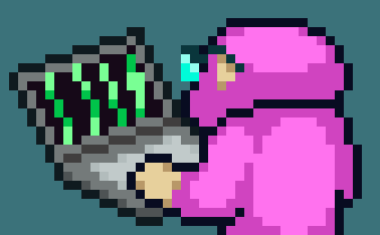

# 💫 Hello! I'm cmontage

### 👨 About me

- 💻 Windows & ArchLinux users (BTW...You know it. XD).
- ⚡ Fullstack developer. Currently learning various development technology stacks.
- 🔭 Currently focused on maintaining the **Windows Package Manager (Scoop ecosystem)**.
- ☁️ Enjoys setting up homelabs and tinkering with NAS systems.
- 🌱 When I’m not writing code, I might be listening to Khalil Fong’s songs or hiking outdoors.

 

### 🛠️ Languages ​​and Tools

  <a href="https://skillicons.dev">
    <!-- 使用精美的玻璃拟态图标 -->
    
  </a>

### 📊 GitHub Statistics

  
  

  <!-- 注意：贪吃蛇动画需要您在仓库配置 GitHub Actions，详情请见说明 -->
  <picture>
    <source media="(prefers-color-scheme: dark)" srcset="https://raw.githubusercontent.com/cmontage/cmontage/output/github-contribution-grid-snake-dark.svg">
    <source media="(prefers-color-scheme: light)" srcset="https://raw.githubusercontent.com/cmontage/cmontage/output/github-contribution-grid-snake.svg">
    
  </picture>

